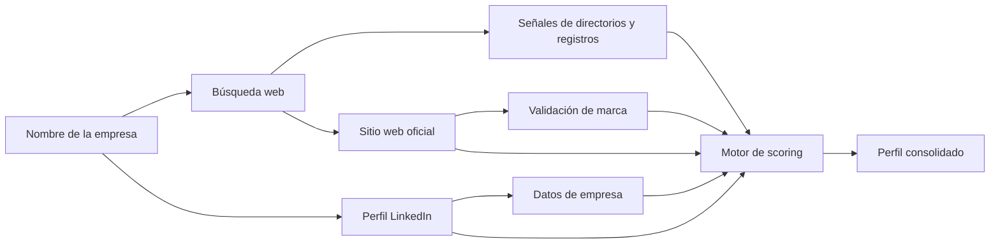

# Enriquecimiento de datos empresariales

**Guía para el cliente**

Este documento explica cómo identificamos y consolidamos la información pública de cada organización a partir de su nombre legal o comercial, qué campos devolvemos y cómo interpretar el grado de confianza de cada resultado.

---

## ¿Qué hacemos?

Por cada empresa de entrada generamos **un único perfil enriquecido** que puede incluir:

| Campo | Descripción |
|-------|-------------|
| Nombre legal | El nombre con el que se nos proporcionó la organización |
| Nombre comercial | Denominación pública con la que opera en el mercado |
| LinkedIn | URL del perfil corporativo en LinkedIn |
| Sitio web | Página oficial de la empresa (solo dominio corporativo) |
| Dominio | Dominio principal del sitio web |
| Sector | Actividad principal (ej. Seguros, Telecomunicaciones) |
| Empleados / seguidores | Tamaño aproximado según perfil público |
| Teléfono | Contacto publicado cuando está disponible |
| Sede | Ubicación de la oficina principal en texto legible |
| Grado de match | Nivel de confianza en la identificación (ver sección dedicada) |
| Puntuación | Valor numérico de 0 a 100 que resume la fuerza de las evidencias |

No se devuelven múltiples candidatos por empresa: el sistema elige **la mejor identidad posible** según las reglas descritas más abajo.

---

## ¿De dónde sale la información?

Utilizamos **varias fuentes complementarias** y las cruzamos de forma automática. No dependemos de una sola fuente para decidir.

### 1. Búsqueda web

Buscamos en internet referencias a la empresa para localizar:

- Su perfil en LinkedIn
- Su sitio web oficial
- Menciones en directorios empresariales, registros mercantiles y otras páginas informativas

Los directorios **no se consideran sitio web de la empresa**. Solo aportan pistas (sector, ciudad, a veces la URL real citada en el texto del listado).

### 2. Fuente profesional de LinkedIn

Cuando tenemos un perfil corporativo candidato, lo consultamos para obtener datos estructurados: nombre comercial, sector, empleados, sede, descripción, etc.

### 3. Validación del sitio web

Si encontramos una web candidata, comprobamos que el contenido menciona a la empresa buscada (título, textos institucionales, aviso legal, «quiénes somos»). Esto evita asignar páginas de terceros con nombres parecidos.

### 4. Mapas y fichas locales (último recurso)

Solo si la búsqueda web no ofrece un sitio fiable, consultamos fichas de negocio en mapas, priorizando la ciudad o provincia conocida de la empresa.

---

## Cómo construimos el perfil

No tomamos el primer resultado que aparece. Aplicamos un **sistema de puntuación** que valora cada señal y elige la combinación más fiable.

### Señales que recogemos

| Origen | Qué aporta |
|--------|------------|
| **Nombre** | Similitud entre el nombre legal y la marca encontrada |
| **LinkedIn** | Coherencia del perfil, posición en resultados, datos de empresa |
| **Sitio web** | Coincidencia del dominio con la marca, páginas corporativas |
| **Directorios** | Sector (seguros, banca…), localización, URL citada en el snippet |
| **Geografía** | Ciudad, provincia y país del lote vs sede y dominio |
| **Tamaño** | Empleados y seguidores cuando están publicados |

### Reglas de calidad (prioridad de fiabilidad)

1. **Mejor vacío que incorrecto**  
   Si la única web encontrada pertenece a otra empresa del mismo nombre en otro país, o a un directorio, **no la asignamos**.

2. **La web oficial pesa más que un listado**  
   Un dominio corporativo validado tiene prioridad sobre enlaces indirectos.

3. **Coherencia geográfica**  
   Para lotes de un país concreto, penalizamos dominios claramente asociados a otro mercado (p. ej. `.pe` para una correduría española), sin limitarnos rigidamente a una extensión concreta.

4. **Marcas relacionadas ≠ misma entidad**  
   Una gestoría o marca comercial vecina puede aparecer como coincidencia **probable**, no como confirmada, aunque esté en el mismo sector.

5. **Portales de terceros**  
   Webs de aseguradoras, consultoras o marketplaces no se asignan como web oficial salvo que la empresa sea precisamente esa entidad.

6. **Un solo resultado por empresa**  
   El motor elige la identidad con mayor puntuación global, no una lista de alternativas.

---

## Grados de match

Cada fila incluye un **grado de match** que indica cuánta confianza tiene el sistema en haber identificado a la organización correcta.

| Grado | Significado | Uso recomendado |
|-------|-------------|-----------------|
| **confirmed** | Coincidencia muy sólida: nombre, web y perfil profesional alineados | Uso directo en CRM, campañas y reporting |
| **high_confidence** | Alta confianza; pequeñas diferencias de nombre o datos secundarios | Uso operativo; revisión puntual si el caso es sensible |
| **probable** | Coincidencia razonable; puede ser marca comercial o entidad relacionada | Revisar antes de decisiones críticas |
| **ambiguous** | Señales contradictorias o varios candidatos cercanos | Revisión manual recomendada |
| **partial** | Hemos identificado **sitio web** (y a veces LinkedIn desde la web) pero **no un perfil LinkedIn fiable** | Útil para contacto web; completar LinkedIn a mano |
| **not_found** | No hay identidad suficientemente fiable | No usar; puede reintentarse con más contexto (ciudad, CIF) |

### Puntuación numérica (0–100)

Acompaña al grado de match y resume la fuerza global de las evidencias. Como orientación:

| Rango | Interpretación |
|-------|----------------|
| 90–100 | Muy alta confianza → `confirmed` |
| 78–89 | Alta confianza → `high_confidence` |
| 60–77 | Confianza media → `probable` |
| 40–59 | Baja confianza → `ambiguous` |
| 0–39 | Insuficiente → `not_found` o `partial` si hay web |

Si dos candidatos quedan muy próximos en puntuación, el sistema **baja automáticamente** el grado de match para reflejar la duda.

---

## Tipos de relación (cuando aplica)

Además del grado de match, en algunos casos indicamos la **relación** entre el nombre legal de entrada y la entidad encontrada:

| Relación | Significado |
|----------|-------------|
| **Misma entidad** | La organización encontrada corresponde a la buscada |
| **Marca comercial** | Marca pública relacionada pero no idéntica al nombre legal |
| **Matriz / grupo** | Página de la empresa madre o grupo internacional |
| **Sucursal** | Oficina o filial geográfica |
| **Desconocida** | No hay clasificación clara |

Esto ayuda a interpretar casos en los que el nombre legal es muy formal (ej. «Correduría X S.L.») y el perfil público usa otra denominación.

---

## ¿Cuándo puede faltar información?

Es normal que algunos campos vengan vacíos. Las causas más habituales:

| Campo vacío | Motivo habitual |
|-------------|-----------------|
| Sitio web | No hay dominio corporativo fiable en fuentes públicas |
| LinkedIn | No hay perfil claro o solo aparecen perfiles no corporativos |
| Sede | El perfil público no publica ubicación |
| Teléfono / empleados | No están disponibles en las fuentes consultadas |
| Sector | Perfil sin actividad declarada |

En estos casos preferimos **dejar el campo vacío** antes que rellenarlo con datos de otra empresa o de un portal ajeno.

---

## Ejemplos de interpretación

### Resultado ideal — `confirmed`

- Nombre legal: *Correduría de Seguros Ejemplo S.L.*
- Web: `ejemploseguros.es`
- LinkedIn: perfil corporativo con el mismo nombre comercial
- Sector: Seguros  
→ Identidad lista para usar.

### Web sin LinkedIn — `partial`

- Web oficial encontrada y validada
- No hay perfil LinkedIn corporativo claro  
→ Útil para web y dominio; completar LinkedIn manualmente si hace falta.

### Marca vecina — `probable`

- Nombre legal muy formal
- LinkedIn de una gestoría o marca comercial del mismo sector y zona, no idéntica al razón social  
→ Revisar si es la entidad operativa que buscáis.

### Sin resultado — `not_found`

- Solo aparecen directorios, noticias o empresas homónimas en otros países  
→ No publicamos datos; conviene aportar ciudad o más contexto en un nuevo proceso.

---

## Qué necesitamos para mejores resultados

| Dato de entrada | Beneficio |
|-----------------|-----------|
| Nombre legal completo | Base de todas las búsquedas |
| Ciudad o provincia | Desambiguación y mejor web/LinkedIn |
| País del lote | Criterios geográficos coherentes |
| CIF / tax ID | Futura validación cruzada (cuando esté disponible) |

---

## Resumen

1. **Varias fuentes**, cruzadas con scoring — no un solo dato aislado.  
2. **Directorios informan**, pero no sustituyen a la web oficial.  
3. **LinkedIn aporta** el perfil estructurado cuando existe match fiable.  
4. **Cada fila lleva un grado de match** para que sepáis cuándo usar el dato directamente y cuándo revisarlo.  
5. **Vacío es mejor que incorrecto** — especialmente en webs y perfiles de otras geografías.

---

*Documento de cliente — versión para compartir. Para detalle de implementación interna, ver `ENRICHMENT_TECHNICAL.md`.*
