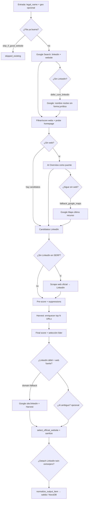

# Enriquecimiento de identidad empresarial — Documentación técnica

Documento interno que describe el pipeline implementado en el Actor **Company Identity Resolver** (`my_actor/`), las reglas de decisión, umbrales de scoring y criterios de publicación de resultados.

---

## 1. Objetivo

A partir de un **nombre legal o comercial** (y metadatos opcionales: ciudad, provincia, país, CIF), producir **una fila consolidada** por empresa con:

- Perfil LinkedIn (URL, nombre comercial, sector, empleados, sede, etc.)
- Sitio web oficial y dominio
- Grado de coincidencia (`match_status`) y puntuación (`confidence`)
- Resumen de evidencias (`evidence_summary`)

El diseño prioriza **precisión sobre cobertura**: es preferible dejar un campo vacío que publicar un gemelo extranjero, un directorio o un portal de aseguradora ajeno a la entidad buscada.

---

## 2. Arquitectura del pipeline

### Orden de fuentes para **sitio web**

| Prioridad | Fuente | Notas |
|-----------|--------|-------|
| 1 | Google organic (query web) | Requiere señal de contenido (título, snippet, página about/aviso legal) |
| 2 | Snippets de directorios | Solo si citan URL con marca (`página web es www...`) |
| 3 | AI Overview | Puente gratuito antes de Maps |
| 4 | Google Maps | Último recurso; sesgo ciudad/provincia, nunca país solo |
| 5 | Harvest website | Solo si coherente con nombre y país del lote |

**Nunca** se publica una URL de LinkedIn como sitio web.

### Orden de fuentes para **LinkedIn**

| Prioridad | Fuente |
|-----------|--------|
| 1 | Resultados Google `site:linkedin.com/company` |
| 2 | Query diferida por nombre núcleo (sin S.L./S.A.) |
| 3 | Enlace extraído de la web oficial |
| 4 | Fallback `site:linkedin.com/company "<dominio>"` |
| 5 | Harvest enrichment sobre URL seleccionada |

---

## 3. Estados de match (`match_status`)

Clasificación en `classify_match_status()` según `final_score` del candidato LinkedIn líder:

| Estado | Umbral | Significado |
|--------|--------|-------------|
| `confirmed` | ≥ 90 | Coincidencia muy fuerte en nombre, dominio y señales |
| `high_confidence` | 78–89 | Alta confianza; usable para CRM/activación |
| `probable` | 60–77 | Coincidencia razonable; revisar si el caso es crítico |
| `ambiguous` | 40–59 | Varias señales mixtas; conviene revisión manual |
| `not_found` | < 40 o sin candidatos | No hay match fiable |
| `partial` | — | Web oficial sin LinkedIn fiable (o LinkedIn desvinculado de twin extranjero) |
| `error` | — | Fallo de ejecución |

### Reglas adicionales de estado

- **Gap demotion**: si el 1.º y 2.º candidato están a < 6 puntos → baja un nivel (`confirmed` → `high_confidence`, etc.).
- **Uplift por relación**: `ambiguous` + score ≥ 50 + relación `{same_entity, commercial_brand, parent_company}` → `probable`.
- **`partial` automático**: hay web publicable pero `match_status` sería `not_found`.
- **Detach LinkedIn**: Google local gana sobre twin Harvest extranjero → se limpia LinkedIn Harvest y se intenta recuperar desde la web; si no hay reemplazo → `partial`, `confidence = 0`.

### Confianza numérica (`confidence`)

- En general: `clamp(final_score, 0, 100)`.
- `not_found`: `min(score, 35)`.
- LinkedIn detached con web: máx. 82 si hay LinkedIn desde web.
- Fila skipped: 90 (confirmed) o 82 (otros).

---

## 4. Tipos de relación (`relationship`)

| Valor | Cuándo |
|-------|--------|
| `same_entity` | Nombre Harvest ≈ legal, cobertura de tokens alta, dominios alineados |
| `commercial_brand` | Marca comercial relacionada pero no idéntica al nombre legal |
| `parent_company` | Página de grupo/matriz (ej. Marsh global vs Marsh Iberica) |
| `branch` | Sucursal / subdominio geográfico |
| `subsidiary` | Filial (enum reservado) |
| `unrelated` | Suppression explícita |
| `unknown` | Sin señal suficiente |
| `requires_review` | Conflicto de dominio o similitud de nombre baja |

---

## 5. Scoring — LinkedIn

### Pre-score (antes de Harvest)

| Señal | Peso |
|-------|------|
| Similitud slug URL vs nombre núcleo | × 0.35 |
| Cobertura de tokens en slug | × 10 |
| Slug parece matriz/grupo | −12 |
| Similitud título SERP | × 0.30 |
| Posición Google (#1…#5) | +18…+4 |
| Términos de sucursal en SERP | −12 |
| Múltiples tipos de query | +10 |
| Ciudad/provincia en snippet | +8 |
| LinkedIn encontrado en web oficial | pre_score fijo 70 |

### Final score (con Harvest)

Contribución pre-score: `× 0.35`.

Señales principales Harvest:

- Similitud nombre, universal name, cobertura tokens
- Coincidencia exacta dominio Google = Harvest (+20)
- Mismatch país web/HQ Harvest vs `country_code` del lote (−42)
- Web Harvest coherente con país (+18)
- Ciudad/provincia en HQ (+6/+4)
- Empleados, followers, industria, página activa/verificada

**Umbrales de selección del líder:**

- Descartar líder si `final_score < 15`
- Preferir siguiente con `≥ 40`, si no `≥ 25`
- Runner-up Harvest extra si líder < 40 y razones incluyen `mismatch` o `suppression`

---

## 6. Scoring — Sitio web

### Filtros duros (candidato eliminado)

- Dominio en `WEBSITE_NOISE_DOMAINS` (directorios, registros, redes, noticias, InfoJobs, etc.)
- Portal de aseguradora/consultora (`_INSURER_PORTAL_DOMAINS`) salvo que el nombre legal sea esa marca
- ccTLD de otro país vs `country_code` (`.com`/`.eu`/`.org` neutros)
- Path editorial sin página corporativa
- Listado de directorio con similitud de dominio < 70
- Dominio sin señal de contenido y similitud < 50

### Puntuación positiva

- Similitud dominio vs nombre legal
- Página about / quienes-somos / aviso legal
- ccTLD del país del lote (+18)
- Alineación sectorial desde nombre + snippets (`seguros`, `corredur`, CNAE 6622, etc.)
- Posición en SERP, probe de homepage (mención de marca en title/body)

### Selección final (`select_official_website`)

1. Google content-backed o sim ≥ 55 → prioridad Google
2. Harvest si relacionado (sim ≥ 25) y Google no ganó claramente
3. Google sin Harvest usable
4. Harvest débil (sim ≥ 20) como último recurso

**Google gana sobre Harvest extranjero** cuando hay señal content-backed y ranking/similitud lo avalan → puede disparar detach de LinkedIn del twin.

---

## 7. Guardas y suppressions (`match_guards.py`)

### Clases de error evitadas

1. `country_mismatch_cctld` — dominio de otro país
2. `noise_directory_domain` — eInforma, Axesor, QDQ, etc.
3. `insurer_portal_domain` — Mapfre, Allianz, KPMG…
4. `harvest_overrides_google` — Google local > Harvest extranjero
5. `foreign_linkedin_twin` — HQ/web Harvest en país distinto
6. `parent_group_as_same_entity` — matriz global como si fuera la filial
7. `explicit_suppression` — lista curada

### Suppressions explícitas (ejemplos)

| Nombre legal contiene | Dominio/LinkedIn bloqueado |
|-----------------------|----------------------------|
| AGA Correduría Arribas | `arribas.pe`, slug Peru twin |
| Cover Seguros | `globalcoverseguros.com.co` |
| Eureka Brokers | `eureka-ins.it` |
| Insurance Manager | `theinsurancemanager.co.uk`, `bcbssc.com` |

### Sanitización final (`_sanitize_final_website`)

Última barrera antes de publicar: noise, garbage, insurer portal, suppressions, ccTLD mismatch.

---

## 8. Harvest — campos extraídos

| Campo | Origen Harvest | Normalización |
|-------|----------------|---------------|
| `commercial_name` | `name` | string |
| `industry` | `industries[]` / `industry` | solo nombre (`industry_name_from_value`) |
| `employee_count` | `employeeCount` | int |
| `employee_range` | `employeeCountRange` | string `11-50` |
| `followers` | `followerCount` | int |
| `phone` | `phone` (dict o string) | string |
| `headquarters_text` | `locations[]` con `headquarter: true` | texto legible (no dict) |
| `headquarters_city/region/country` | `locations[].parsed` | strings |
| `logo` | `logo.url` | URL |
| `description`, `tagline` | directo | string |
| `specialties` | `specialities` | lista de strings |
| `founded_year` | `foundedOn.year` | int |

**Nota:** Harvest no expone `headquarter` top-level en la mayoría de empresas; la sede se deriva de `locations[]`.

---

## 9. Normalización de salida (`output_normalize.py`)

Se ejecuta **siempre** en `to_dataset_item()` y en PATCH a NocoDB (`normalize_noco_patch`):

- Industrias, teléfono, HQ: nunca objetos JSON ni `str(dict)`
- URLs web y LinkedIn normalizadas
- `locations[]` → lista de textos en export
- `headquarters` dict crudo → `null` en salida no-debug
- Enteros/floats coercionados

Scripts Noco:

- `scripts/enrich_pending_nocodb.py` — enrich completo + PATCH
- `scripts/reenrich_empty_batch.py` — solo parches seguros (guards)
- `scripts/backfill_headquarters_nocodb.py` — solo HQ vía LinkedIn URL (sin re-enrich completo)

---

## 10. Configuración del Actor

### Por empresa (`CompanyInput`)

- `legal_name` (obligatorio), `source_id`, `tax_id`
- `city`, `province`, `country` — sesgo geográfico
- `existing_*` — skip si ya hay web buena

### Runtime (`ActorSettings`) — defaults relevantes

| Parámetro | Default | Efecto |
|-----------|---------|--------|
| `country_code` | `es` | Geo Google + lógica ccTLD |
| `max_harvest_candidates` | 2 | URLs LinkedIn enriquecidas por empresa |
| `harvest_pre_score_gap` | 15 | Si gap grande, solo enriquece el líder |
| `fallback_confidence_threshold` | 78 | Dispara domain→LinkedIn fallback |
| `fallback_google_maps` | true | Maps como último recurso web |
| `max_website_probes` | 2 | Homepages validadas |
| `skip_if_good_website` | true | No re-procesar confirmed + web OK |
| `defer_core_linkedin` | true | Ahorra query si el nombre legal ya encuentra LI |
| `use_ai_for_ambiguous` | false | OpenAI solo si se activa |

---

## 11. Matriz de campos publicados

| Situación | Web | LinkedIn | Firmographics | `enrichment_status` |
|-----------|-----|----------|---------------|---------------------|
| Match completo | ✓ | ✓ | ✓ | `enriched` |
| Solo Google | ✓/✗ | ✓ | parcial | `google_only` |
| Harvest falló | ✓ | ✓ | ✗ | `harvest_failed_google_kept` |
| Solo web | ✓ | ✗ | ✗ | `partial` |
| Nada | ✗ | ✗ | ✗ | `not_found` |
| Skip | existente | existente | no re-fetch | `skipped_existing` |
| Twin detach | ✓ Google | web o vacío | limpiados | `partial` / `google_only` |

---

## 12. Principios de diseño (no regresión)

1. **Vacío > gemelo extranjero** — mejor sin web que `arribas.pe` para AGA España.
2. **Google content-backed > Harvest twin** — web local verificada gana.
3. **Directorios aportan señales, no dominio** — sector/CNAE desde snippet; URL solo si citan web de marca.
4. **Marca comercial local** puede ser `probable` / `commercial_brand`, no `confirmed` ciego.
5. **País relativo al lote** — sin hardcode “solo .es”; `country_code` gobierna ccTLD.
6. **Suppressions curadas** — excepciones puntuales, no listas infinitas por empresa.
7. **Normalización en escritura** — Noco/dataset nunca reciben blobs Harvest crudos.

---

## 13. Referencia de código

| Módulo | Responsabilidad |
|--------|-----------------|
| `resolver.py` | Orquestación pipeline |
| `google_search.py` | Queries, filtros SERP, directorios, AI Overview |
| `scoring.py` | Pre/final score, website candidates, match status |
| `normalization.py` | Nombres legales, URLs, noise domains, select website |
| `match_guards.py` | Suppressions, country mismatch |
| `harvest.py` | Cliente API + extracción firmographics/HQ |
| `maps_fallback.py` | Google Places último recurso |
| `output_normalize.py` | Sanitización pre-escritura |
| `website_probe.py` | Validación homepage |

---

*Última revisión: alineado con rama `cursor/fix-generic-website-query-f25d` (HQ desde `locations[]`, normalización de industry/HQ).*
